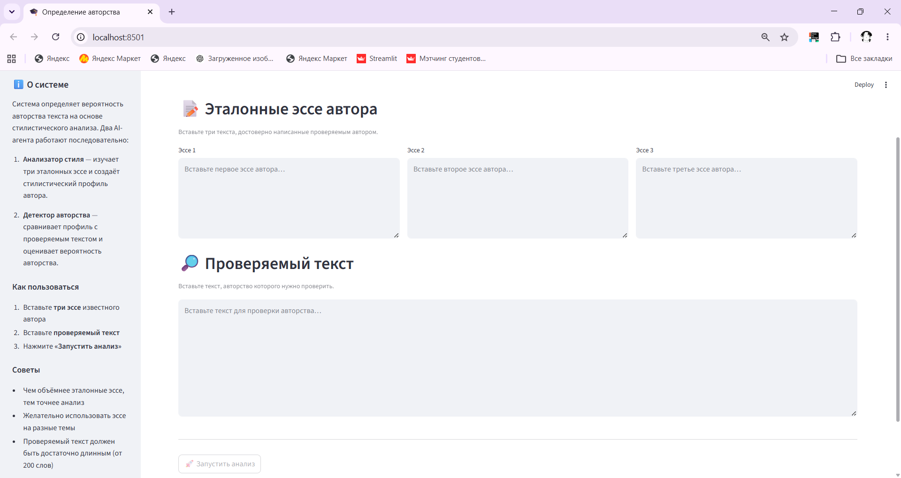

# 🎓 Multiagent Authorship Detector

> Мультиагентная система определения авторства текста на основе стилистического анализа эталонных образцов.

**Автор:** Гульназ Исабаева · [isabaewa.g.05@gmail.com](mailto:isabaewa.g.05@gmail.com)

Два AI-агента на базе **CrewAI** последовательно анализируют стиль письма и определяют вероятность авторства проверяемого текста. Языковая модель — **Google Gemini**.

## 🧠 Как это работает

```
┌──────────────────┐      ┌──────────────────┐
│  Анализатор      │      │  Детектор        │
│  стиля           │ ───▶ │  авторства       │
│                  │      │                  │
│  Вход: 3 эссе    │      │  Вход: профиль + │
│  Выход: профиль  │      │  проверяемый текст│
└──────────────────┘      └──────────────────┘
```

1. **Анализатор стиля** изучает три эталонных эссе студента и создаёт подробный стилистический профиль: лексика, длина предложений, тон, грамматические привычки, стиль аргументации.

2. **Детектор авторства** получает стилистический профиль и проверяемый текст, сравнивает их и определяет вероятность авторства с развёрнутым обоснованием.

## 🛠️ Технологии

| Компонент | Технология |
|-----------|-----------|
| Фреймворк агентов | [CrewAI](https://github.com/crewAIInc/crewAI) |
| Языковая модель | Google Gemini (через CrewAI LLM) |
| Веб-интерфейс | [Streamlit](https://streamlit.io) |
| Язык | Python 3.11+ |

## 📸 Скриншот интерфейса



## 📦 Установка

```bash
# Клонируйте репозиторий
git clone https://github.com/isabaewa/multiagent-authorship-detector.git
cd multiagent-authorship-detector

# Создайте виртуальное окружение
python -m venv venv

# Активируйте (Windows)
venv\Scripts\activate

# Активируйте (macOS / Linux)
source venv/bin/activate

# Установите зависимости
pip install -r requirements.txt
```

## ⚙️ Конфигурация

Создайте файл `.env` на основе примера:

```bash
cp .env.example .env
```

Откройте `.env` и вставьте ваш API-ключ Google Gemini:

```
GOOGLE_API_KEY=ваш_ключ_здесь
```

Получить ключ можно на [Google AI Studio](https://aistudio.google.com/apikey).

### Переопределение модели

По умолчанию используется `gemini/gemini-2.0-flash`. Чтобы сменить модель, добавьте в `.env`:

```
LLM_MODEL=gemini/gemini-2.5-pro
```

## 🚀 Запуск

```bash
streamlit run src/streamlit_app.py
```

Приложение откроется в браузере по адресу http://localhost:8501.

## 📂 Структура проекта

```
multiagent-authorship-detector/
├── .env.example          # Шаблон переменных окружения
├── .gitignore
├── requirements.txt      # Зависимости Python
├── runtime.txt           # Версия Python для деплоя
├── README.md
└── src/
    ├── __init__.py       # Пакет
    ├── crew_agents.py    # Определения агентов и LLM
    ├── crew_tasks.py     # Определения задач с промптами
    ├── crew_setup.py     # Сборка CrewAI-команды
    └── streamlit_app.py  # Веб-интерфейс
```

### Назначение файлов

| Файл | Описание |
|------|----------|
| `crew_agents.py` | Конфигурация LLM и определения двух агентов (Анализатор стиля, Детектор авторства) |
| `crew_tasks.py` | Описание задач для агентов — промпты на русском языке с явной связью `context` |
| `crew_setup.py` | Сборка команды — связывает агентов и задачи в единую CrewAI-команду |
| `streamlit_app.py` | Пользовательский интерфейс — ввод данных, запуск анализа, отображение результата |

## 🔍 Пример использования

1. Вставьте три текста, написанные проверяемым студентом
2. Вставьте текст, авторство которого нужно проверить (например, главу диплома)
3. Нажмите **«Запустить анализ»**
4. Система выдаст оценку вероятности авторства (в процентах) с развёрнутым обоснованием

## ⚠️ Ограничения

- Точность анализа зависит от объёма и разнообразия эталонных текстов
- Рекомендуется использовать эссе на разные темы для более точного профиля
- Проверяемый текст должен содержать не менее 200 слов
- Система оценивает стилистическое сходство, а не гарантирует авторство

## 📝 Лицензия

MIT